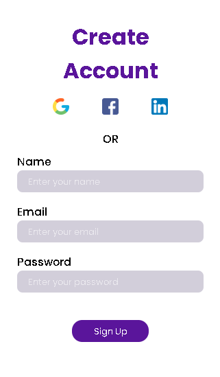

# SignIn-page
Sign In responsive page made with HTML and CSS.

As a responsive page, it looks different in portrait and landscape view. The images below show this difference.
It also have some animations just to be less static. 

